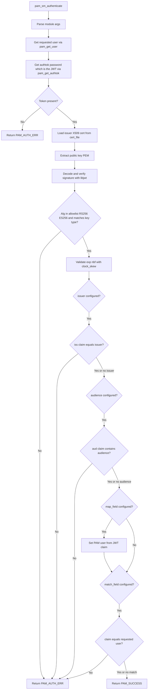

# Plan: `pam-jwt` — PAM module authenticating via JWT

A C shared library implementing a Linux PAM module. `pam_sm_authenticate()`
verifies a JWT supplied as the PAM password (authtok). The JWT signature is
checked against an issuer **X.509 certificate** loaded from a file named in the
module configuration. Issuer and audience are optionally checked. The target
user can be taken from a configurable JWT field (mapping) and/or a configurable
JWT field can be required to equal the user requesting authentication (binding).
Both username options are independent and default off.

## Confirmed decisions

| Topic | Decision |
|---|---|
| Language / target | C, Linux-PAM shared module (`pam_jwt.so`) |
| JWT library | `libjwt` (benmcollins/libjwt) with OpenSSL backend |
| Crypto / cert | OpenSSL `PEM_read_X509` → `X509_get_pubkey` → PEM public key fed to libjwt |
| Algorithms | RS256 (RSA) and ES256 (ECDSA); auto-detected from JWT header, validated against an allowlist and the cert key type (prevents alg-confusion / `none` attacks) |
| Token delivery | JWT passed as the PAM password via `pam_get_authtok()` |
| Username mapping | Independent option, default off |
| Username binding | Independent option, default off |
| Build | GNU `make` Makefile; `pkg-config` for libjwt / openssl / pam |
| VCS | git, conventional commits, `v0.2.0` tag |
| Docs | `README.md`, `AGENTS.md`, `examples/pam-jwt.conf`, `docs/config.md` |

## Module configuration (PAM args, `argc`/`argv`)

| Arg | Required | Default | Meaning |
|---|---|---|---|
| `cert_file=<path>` | yes | — | Path to issuer X.509 cert (PEM) |
| `issuer=<string>` | no | unset | If set, require `iss` claim to equal this |
| `audience=<string>` | no | unset | If set, require `aud` claim to contain this |
| `map_field=<claim>` | no | unset | If set, set the PAM user from this JWT claim |
| `fallback_user=<user>` | no | unset | PAM user when `map_field` claim is missing/empty (requires `map_field`) |
| `match_field=<claim>` | no | unset | If set, require this JWT claim to equal the requested user |
| `clock_skew=<sec>` | no | `0` | Leeway for `exp` / `nbf` validation |
| `debug` | no | off | Verbose `pam_syslog` logging (never logs tokens) |

## Project layout

```
pam-jwt/
├── README.md
├── AGENTS.md
├── Makefile
├── .gitignore
├── include/
│   └── pam_jwt.h
├── src/
│   ├── pam_jwt.c        # pam_sm_authenticate + stubs
│   ├── config.c         # parse argc/argv -> struct pam_jwt_cfg
│   ├── jwt_verify.c     # cert load, sig verify, claim + user checks
│   └── util.c           # logging + helpers
├── tests/
│   ├── run_tests.c      # tiny custom test runner main
│   ├── test_config.c
│   ├── test_jwt_verify.c
│   ├── test_claims.c
│   ├── test_users.c
│   ├── pam_harness.c    # integration: pam_start / pam_authenticate
│   └── fixtures/
│       ├── gen_certs.sh # openssl: RSA + EC key/cert
│       └── make_jwt.c   # C helper minting test JWTs via libjwt
├── examples/
│   └── pam-jwt.conf
├── docs/
│   └── config.md
└── plans/
    └── plan.md
```

## Authentication flow



## Build & test commands (Makefile targets)

- `make` / `make all` — build `src/pam_jwt.so`
- `make test` / `make check` — build test binaries, generate fixtures, run full suite
- `make clean` — remove build artifacts
- `make install` — install `.so` + example config (honors `DESTDIR` / `PREFIX`)

Compile flags: `-Wall -Wextra -Werror -fPIC -fvisibility=hidden`; link
`-shared -lpam -ljwt -lssl -lcrypto` (via `pkg-config`).

## Test strategy

1. **Unit — config parser**: every arg, defaults, duplicates, missing required.
2. **Unit — cert + signature**: RSA/EC cert load, bad file, non-cert PEM,
   valid RS256, valid ES256, tampered signature, wrong key, `alg=none` rejected.
3. **Unit — claims**: `iss` match/mismatch/missing, `aud` match/mismatch/missing,
   expired, not-yet-valid, clock_skew behavior.
4. **Unit — usernames**: mapping sets user; binding passes on match / fails on
   mismatch; both off; both on and consistent / inconsistent.
5. **Integration — PAM harness**: C program calling `pam_start("pam_jwt_test",
   user, &conv, &pamh)` + `pam_authenticate`, feeding the JWT through a
   conversation callback; asserts return codes across a matrix of scenarios.
6. **Fixtures**: `tests/fixtures/gen_certs.sh` (openssl CLI) produces RSA and EC
   keys/certs; `make_jwt.c` (libjwt encoder) mints the suite of tokens. Tests are
   self-contained in C + shell, no Python dependency.

## Security rules (enforced + documented)

- Reject `alg=none` and any algorithm outside {RS256, ES256}.
- Enforce that the JWT algorithm matches the certificate key type.
- Never log the token, password, or private key material.
- Warn (debug) if `cert_file` is world-writable.
- Use `pam_syslog(LOG_AUTHPRIV|LOG_DEBUG, ...)` only when `debug` set.

## Git workflow

- `git init`, initial commit with scaffolding.
- Conventional commits (`feat:`, `test:`, `docs:`, `fix:`).
- `main` branch; feature branches per todo group.
- Tag `v0.2.0` once build + tests are green.
`
## Todos

Implementation checklist (update status as work lands):

- [x] Scaffold planning doc ([`plans/plan.md`](plans/plan.md))
- [x] Create [`AGENTS.md`](AGENTS.md) — agent guidance
- [x] Scaffold repo: `README.md`, `Makefile`, `.gitignore`, `include/pam_jwt.h`; `git init`
- [x] Implement `config.c`: parse `argc`/`argv` into `struct pam_jwt_cfg`
- [x] Implement `util.c`: `pam_syslog` logging + helpers
- [x] Implement `jwt_verify.c`: cert load, signature verify, claim + user checks
- [x] Implement `pam_jwt.c`: `pam_sm_authenticate` + stubs
- [x] Unit tests: `test_config.c` (args, defaults, duplicates, missing required)
- [x] Unit tests: `test_util.c` (logging gate, strdup, world-writable, read_file)
- [x] Unit tests: `test_jwt_verify.c` (cert + signature; alg-confusion/`none` rejected)
- [x] Unit tests: `test_claims.c` (`iss`/`aud`, `exp`/`nbf`, `clock_skew`)
- [x] Unit tests: `test_users.c` (mapping + binding, both off/on)
- [x] Integration harness: `pam_harness.c` (`pam_start_confdir` + `pam_authenticate`)
- [x] Fixtures: `tests/fixtures/gen_certs.sh` + `tests/fixtures/make_jwt.c`
- [x] Docs: `examples/pam-jwt.conf` + `docs/config.md`
- [x] `make clean && make && make test` green: 156/156 cases, 970/970 assertions, no warnings

## v0.1.0 readiness — known follow-ups (do not block the v0.1.0 tag)

- **`make test-asan` × `pam_harness` group.** The integration harness
  ([`tests/pam_harness.c`](tests/pam_harness.c)) hard-codes
  `PAMD_DIR = "build/pam.d"` and points libpam at
  `$PWD/build/pam_jwt.so`. Under `make test-asan` the instrumented
  module is built into `build/asan/`, so libpam cannot find the .so and
  every pam_harness scenario returns `PAM_AUTH_ERR` (code 28). The
  parser/verify groups (`config`, `util`, `jwt_verify`, `claims`,
  `users`) are fully clean under ASan+UBSan; no leaks, UAF, or
  undefined behavior is reported. The fix is to make the harness's
  `.so` path a compile-time `-D` (mirroring `FIX_DIR` /
  `MAKE_JWT`) and to point it at `build/asan/pam_jwt.so` from the
  `test-asan` Makefile target. Tracked as a v0.1.0 follow-up; the
  v0.1.0 tag is gated on the agent-checklist
  "`make clean && make && make test` passes with no warnings", which
  is satisfied.
- **v0.1.0 tag.** Ready to push once the tag commit is drafted.

## v0.2.0 readiness — bundled in this release

The `feat/release-target` branch accumulates the engineering work that
turns the v0.1.0 sources into a packagable, hardened shared object.
Bumping to `v0.2.0` ships all of the following on top of v0.1.0:

- **`make release` + `make install-release`.** New Makefile targets
  produce a hardened, stripped `pam_jwt.so` at
  `build/release/pam_jwt.so` (independent of the debug tree at
  `build/`). The release build is `-O3 -flto -DNDEBUG`, links with
  full RELRO + immediate binding + GNU hash + build-id, and is
  restricted by a version script
  ([`pam_jwt.map`](../pam_jwt.map)) that exports only the six
  `pam_sm_*` entry points Linux-PAM looks up. `PAM_JWT_VERSION` is
  baked in from `git describe --tags --always --dirty`, falling back
  to `dev` for tarball builds.
- **`make test-asan`.** Reconfigures the build tree with
  AddressSanitizer + UBSan, re-runs the suite, and runs LeakSanitizer
  at exit. The `pam_harness` group was wired through a compile-time
  `-D` so it locates the ASan-instrumented `.so` at
  `build/asan/pam_jwt.so`. Coverage now spans
  `test_config.c` + `test_util.c` + `test_jwt_verify.c` +
  `test_claims.c` + `test_users.c` + `pam_harness.c` under ASan.
- **Vendored libjwt 1.17.2.** `vendor/libjwt/` is built as a static
  archive and `--whole-archive`-linked into both the debug and release
  `.so` files. The system `libjwt-dev` is no longer a build-time
  dependency, so the build is self-contained across distros whose
  `libjwt` packages are not API-compatible (Debian 13 ships 1.x,
  Alpine 3.24 ships 3.x). See
  [`vendor/libjwt/README.md`](../vendor/libjwt/README.md).
- **Alpine packaging.** [`scripts/build-alpine-pkg.sh`](../scripts/build-alpine-pkg.sh)
  builds the release `.so` inside a container and assembles an
  unsigned `.apk`, deriving the package version from the same
  `git describe` value that gets baked into the `.so`. Honors
  `DESTDIR` / `PREFIX` like the in-tree install.
- **Mandatory username binding with `sub` fallback.**
  Username binding is now always enforced: when `match_field` is
  unset the verifier falls back to the JWT standard `sub` claim and
  requires it to equal the requesting user. A token that omits the
  bound claim (or carries it as the empty string) is rejected with
  `PAM_USER_UNKNOWN`. Mapping (`map_field`) and binding
  (`match_field`) remain independent options that both default off.
- **`fallback_user` option.** Substitutes for the mapped
  `map_field` claim when that claim is missing or empty in a verified
  token; meaningful only when `map_field` is also set, otherwise
  rejected at parse time as `PAM_JWT_CFG_E_INVALID_VALUE`. The
  substitution does NOT participate in the binding check.
- **Test-suite growth.** The suite now runs **156 cases / 970
  assertions** under `make clean && make && make test`, with no
  warnings and no leaks under `make test-asan`. New coverage spans
  `pam_jwt_strdup`, `pam_jwt_is_world_writable`,
  `pam_jwt_read_file`, `aud` array semantics, and the new
  `sub`-fallback / `fallback_user` paths.
- **Agent-checklist gate.** `make clean && make && make test` is
  required to pass with zero warnings before tagging, per
  [`AGENTS.md`](../AGENTS.md).

## Post-review follow-ups (from non-test code review)

Tracked findings from a careful review of [`include/pam_jwt.h`](../include/pam_jwt.h),
[`src/pam_jwt.c`](../src/pam_jwt.c), [`src/config.c`](../src/config.c),
[`src/jwt_verify.c`](../src/jwt_verify.c), [`src/util.c`](../src/util.c),
the [`Makefile`](../Makefile), and the docs. Ordered by priority.

### High — code/doc vs. spec mismatches

- [x] **`audience` array semantics documented but not implemented.**
      [`docs/config.md`](../docs/config.md) and
      [`examples/pam-jwt.conf`](../examples/pam-jwt.conf) promise array-aware
      containment ("If `aud` is an array, the configured value must be one of
      its elements"), but [`src/jwt_verify.c`](../src/jwt_verify.c) uses
      `jwt_get_grant(jwt, "aud")` + exact `str_eq`, which rejects arrays
      outright (libjwt returns `NULL` for a JSON array). Either implement
      array iteration (e.g. `jwt_get_grants_json` + JSON parsing, or libjwt's
      `jwt_valid_set_aud`/validation) or fix the docs to state string-only
      matching. This is also a real interop gap: RFC 7519 permits `aud` to be
      an array.
      Resolved: [`src/jwt_verify.c`](../src/jwt_verify.c) now falls back to
      `jwt_get_grants_json()` and walks the array when `aud` is not a
      JSON string; covered by 7 new cases in
      [`tests/test_claims.c`](../tests/test_claims.c) (`aud array:` group),
      all green under `make clean && make && make test` and
      `make test-asan`.
- [x] **Return-code table in [`docs/config.md`](../docs/config.md) is wrong
      vs. code.**
      - `PAM_AUTHTOK_ERR` is listed but [`src/pam_jwt.c`](../src/pam_jwt.c)
        returns `PAM_AUTH_ERR` when `pam_get_authtok` fails or the token is
        empty.
      - `PAM_USER_UNKNOWN` is documented as "`pam_get_user()` returned no
        user" only; it is also returned by [`src/jwt_verify.c`](../src/jwt_verify.c)
        when `match_field` does not equal the requested user — absent from
        the docs.
      Resolved: the table in [`docs/config.md`](../docs/config.md) now
      lists only the codes `pam_sm_authenticate()` actually returns
      (`PAM_SUCCESS`, `PAM_AUTH_ERR`, `PAM_USER_UNKNOWN`,
      `PAM_SERVICE_ERR`, `PAM_BUF_ERR`), with a `Returned by` column
      pinpointing which file (`src/pam_jwt.c` vs `src/jwt_verify.c`)
      emits each one. The omitted `PAM_AUTHTOK_ERR` is called out in a
      note explaining that the code path collapses to `PAM_AUTH_ERR`,
      and the `match_field` mismatch path is listed under
      `PAM_USER_UNKNOWN`. The return values of the other entry points
      (`pam_sm_setcred`, `pam_sm_acct_mgmt`,
      `pam_sm_open_session`/`close_session`, `pam_sm_chauthtok`) are
      documented separately below the table.
- [x] **`map_field` empty-value rejection is documented but not enforced.**
      [`docs/config.md`](../docs/config.md) states the mapped claim must be
      non-empty. The mapping path in [`src/jwt_verify.c`](../src/jwt_verify.c)
      only checks `claim == NULL`, so an empty-string `""` map claim is
      accepted and promoted to `PAM_USER` as an empty name. Add an explicit
      `claim[0] == '\0'` rejection.

### Medium — correctness/robustness

- [x] **`clock_skew` status masking.** `check_time_claims` in
      [`src/jwt_verify.c`](../src/jwt_verify.c) ignores any libjwt status
      bit other than `JWT_VALIDATION_EXPIRED` / `JWT_VALIDATION_TOO_NEW`
      (intentional, since iss/aud are checked by hand). Add a one-line
      comment so a future maintainer doesn't "fix" it into a regression.
      Resolved: the comment above the status mask now explicitly notes
      that the mask is intentional and warns against "tightening" the
      check into a regression.
- [x] **`clock_skew=+N` is silently accepted.** `parse_nonneg_int` in
      [`src/config.c`](../src/config.c) accepts a leading `+`. Harmless but
      undocumented. Decide and either document or reject.
      Resolved: documented in [`docs/config.md`](../docs/config.md)
      ("Negative values are rejected at parse time. A leading `+` is
      accepted for compatibility with operators used to writing signed
      integers"), with a matching implementation note in `parse_nonneg_int`,
      and a new positive test in
      [`tests/test_config.c`](../tests/test_config.c) asserting
      `clock_skew=+30` parses to `30`.
- [x] **World-writable cert warning is double-gated behind `debug`.**
      [`src/jwt_verify.c`](../src/jwt_verify.c) only checks/warns when
      `cfg->debug` is set. This is a privilege-escalation precursor;
      consider promoting to `LOG_ERR` (always emitted) per the project's
      own security framing.
      Resolved: the world-writable check now always runs, and the
      warning is emitted at `LOG_ERR` regardless of the `debug` option.
      Documented in [`docs/config.md`](../docs/config.md) ("If the file
      is world-writable, the module emits a warning at `LOG_ERR` ...
      **regardless of the `debug` option**") and in the AGENTS.md
      security rules. Authentication is still NOT refused on this
      condition.
- [x] **`promote_mapped_user` comment.** [`src/pam_jwt.c`](../src/pam_jwt.c)
      clears the slot via `pam_set_data(key, NULL, cleanup)`, which invokes
      the old cleanup (freeing the buffer) before overwriting. The code is
      correct; the comment could state this explicitly.
      Resolved: the inline comment above the clearing `pam_set_data()`
      call now explains the cleanup-on-overwrite semantics, warns a
      future maintainer against adding a manual `free(mapped)` (which
      would double-free the buffer), and clarifies that the heap
      copy is released by libpam, not by us.

### Low — style/consistency

- [x] **Dead variable `alg_name`.** [`src/jwt_verify.c`](../src/jwt_verify.c)
      computes `jwt_alg_str(alg)` then discards it with `(void)alg_name;`.
      Either log the alg name in the debug message (it's a public, non-secret
      header value) or delete the dead code.
      Resolved: the alg name is now interpolated into the
      "rejecting token with disallowed alg=%s" debug message; the
      `(void)alg_name;` is gone.
- [x] **Duplicated teardown in [`src/jwt_verify.c`](../src/jwt_verify.c).**
      `jwt_free` / `memset` / `free(pubkey_pem)` is repeated ~6×. Collapse
      to a single `goto cleanup` pattern.
      Resolved: every failure path now sets `ret` and `goto cleanup`;
      a single `cleanup:` label releases `jwt` and wipes+frees the
      heap-allocated PEM buffer. Both pointers are NULL-checked so
      the early-return paths (which never allocated either) still
      compose cleanly.
- [x] **`prior_strings[5]` in [`src/config.c`](../src/config.c) hard-codes
      the count.** Add a comment pinning it to the struct definition so a
      new string field doesn't silently leak.
      Resolved: a comment above the `char *prior_strings[5];`
      declaration enumerates the five heap-owned `char *` fields in
      `struct pam_jwt_cfg` (see `include/pam_jwt.h`), explains the
      leak hazard if a new field is added, and notes that
      `clock_skew`/`debug` are scalar/POD and bypass the snapshot.
- [x] **[`README.md`](../README.md) status line is stale.** Still says
      "Pre-release, scaffolding stage. No code has been written yet."
      Update before tagging `v0.1.0`. Also the repo layout omits
      `tests/test_util.c`, `tests/test.c`, `tests/test.h`.
      Resolved: the Status block now reads "Ready for `v0.1.0`"
      with the current green-suite totals; the Repository layout
      block now mirrors [`AGENTS.md`](../AGENTS.md) (per-file
      comments on `src/` and `tests/`), and lists `test_util.c`,
      `test.c`, and `test.h` under `tests/`.
