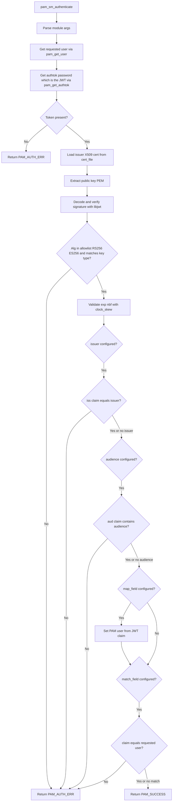

# Plan: `pam-jwt` — PAM module authenticating via JWT

A C shared library implementing a Linux PAM module. `pam_sm_authenticate()`
verifies a JWT supplied as the PAM password (authtok). The JWT signature is
checked against an issuer **X.509 certificate** loaded from a file named in the
module configuration. Issuer and audience are optionally checked. The target
user can be taken from a configurable JWT field (mapping) and/or a configurable
JWT field can be required to equal the user requesting authentication (binding).
Both username options are independent and default off.

## Confirmed decisions

| Topic | Decision |
|---|---|
| Language / target | C, Linux-PAM shared module (`pam_jwt.so`) |
| JWT library | `libjwt` (benmcollins/libjwt) with OpenSSL backend |
| Crypto / cert | OpenSSL `PEM_read_X509` → `X509_get_pubkey` → PEM public key fed to libjwt |
| Algorithms | RS256 (RSA) and ES256 (ECDSA); auto-detected from JWT header, validated against an allowlist and the cert key type (prevents alg-confusion / `none` attacks) |
| Token delivery | JWT passed as the PAM password via `pam_get_authtok()` |
| Username mapping | Independent option, default off |
| Username binding | Independent option, default off |
| Build | GNU `make` Makefile; `pkg-config` for libjwt / openssl / pam |
| VCS | git, conventional commits, `v0.1.0` tag |
| Docs | `README.md`, `AGENTS.md`, `examples/pam-jwt.conf`, `docs/config.md` |

## Module configuration (PAM args, `argc`/`argv`)

| Arg | Required | Default | Meaning |
|---|---|---|---|
| `cert_file=<path>` | yes | — | Path to issuer X.509 cert (PEM) |
| `issuer=<string>` | no | unset | If set, require `iss` claim to equal this |
| `audience=<string>` | no | unset | If set, require `aud` claim to contain this |
| `map_field=<claim>` | no | unset | If set, set the PAM user from this JWT claim |
| `match_field=<claim>` | no | unset | If set, require this JWT claim to equal the requested user |
| `clock_skew=<sec>` | no | `0` | Leeway for `exp` / `nbf` validation |
| `debug` | no | off | Verbose `pam_syslog` logging (never logs tokens) |

## Project layout

```
pam-jwt/
├── README.md
├── AGENTS.md
├── Makefile
├── .gitignore
├── include/
│   └── pam_jwt.h
├── src/
│   ├── pam_jwt.c        # pam_sm_authenticate + stubs
│   ├── config.c         # parse argc/argv -> struct pam_jwt_cfg
│   ├── jwt_verify.c     # cert load, sig verify, claim + user checks
│   └── util.c           # logging + helpers
├── tests/
│   ├── run_tests.c      # tiny custom test runner main
│   ├── test_config.c
│   ├── test_jwt_verify.c
│   ├── test_claims.c
│   ├── test_users.c
│   ├── pam_harness.c    # integration: pam_start / pam_authenticate
│   └── fixtures/
│       ├── gen_certs.sh # openssl: RSA + EC key/cert
│       └── make_jwt.c   # C helper minting test JWTs via libjwt
├── examples/
│   └── pam-jwt.conf
├── docs/
│   └── config.md
└── plans/
    └── plan.md
```

## Authentication flow



## Build & test commands (Makefile targets)

- `make` / `make all` — build `src/pam_jwt.so`
- `make test` / `make check` — build test binaries, generate fixtures, run full suite
- `make clean` — remove build artifacts
- `make install` — install `.so` + example config (honors `DESTDIR` / `PREFIX`)

Compile flags: `-Wall -Wextra -Werror -fPIC -fvisibility=hidden`; link
`-shared -lpam -ljwt -lssl -lcrypto` (via `pkg-config`).

## Test strategy

1. **Unit — config parser**: every arg, defaults, duplicates, missing required.
2. **Unit — cert + signature**: RSA/EC cert load, bad file, non-cert PEM,
   valid RS256, valid ES256, tampered signature, wrong key, `alg=none` rejected.
3. **Unit — claims**: `iss` match/mismatch/missing, `aud` match/mismatch/missing,
   expired, not-yet-valid, clock_skew behavior.
4. **Unit — usernames**: mapping sets user; binding passes on match / fails on
   mismatch; both off; both on and consistent / inconsistent.
5. **Integration — PAM harness**: C program calling `pam_start("pam_jwt_test",
   user, &conv, &pamh)` + `pam_authenticate`, feeding the JWT through a
   conversation callback; asserts return codes across a matrix of scenarios.
6. **Fixtures**: `tests/fixtures/gen_certs.sh` (openssl CLI) produces RSA and EC
   keys/certs; `make_jwt.c` (libjwt encoder) mints the suite of tokens. Tests are
   self-contained in C + shell, no Python dependency.

## Security rules (enforced + documented)

- Reject `alg=none` and any algorithm outside {RS256, ES256}.
- Enforce that the JWT algorithm matches the certificate key type.
- Never log the token, password, or private key material.
- Warn (debug) if `cert_file` is world-writable.
- Use `pam_syslog(LOG_AUTHPRIV|LOG_DEBUG, ...)` only when `debug` set.

## Git workflow

- `git init`, initial commit with scaffolding.
- Conventional commits (`feat:`, `test:`, `docs:`, `fix:`).
- `main` branch; feature branches per todo group.
- Tag `v0.1.0` once build + tests are green.

## Todos

Implementation checklist (update status as work lands):

- [x] Scaffold planning doc ([`plans/plan.md`](plans/plan.md))
- [x] Create [`AGENTS.md`](AGENTS.md) — agent guidance
- [x] Scaffold repo: `README.md`, `Makefile`, `.gitignore`, `include/pam_jwt.h`; `git init`
- [x] Implement `config.c`: parse `argc`/`argv` into `struct pam_jwt_cfg`
- [x] Implement `util.c`: `pam_syslog` logging + helpers
- [x] Implement `jwt_verify.c`: cert load, signature verify, claim + user checks
- [x] Implement `pam_jwt.c`: `pam_sm_authenticate` + stubs
- [x] Unit tests: `test_config.c` (args, defaults, duplicates, missing required)
- [x] Unit tests: `test_util.c` (logging gate, strdup, world-writable, read_file)
- [x] Unit tests: `test_jwt_verify.c` (cert + signature; alg-confusion/`none` rejected)
- [x] Unit tests: `test_claims.c` (`iss`/`aud`, `exp`/`nbf`, `clock_skew`)
- [x] Unit tests: `test_users.c` (mapping + binding, both off/on)
- [x] Integration harness: `pam_harness.c` (`pam_start_confdir` + `pam_authenticate`)
- [x] Fixtures: `tests/fixtures/gen_certs.sh` + `tests/fixtures/make_jwt.c`
- [x] Docs: `examples/pam-jwt.conf` + `docs/config.md`
- [x] `make clean && make && make test` green: 128/128 cases, 885/885 assertions, no warnings

## v0.1.0 readiness — known follow-ups (do not block the v0.1.0 tag)

- **`make test-asan` × `pam_harness` group.** The integration harness
  ([`tests/pam_harness.c`](tests/pam_harness.c)) hard-codes
  `PAMD_DIR = "build/pam.d"` and points libpam at
  `$PWD/build/pam_jwt.so`. Under `make test-asan` the instrumented
  module is built into `build/asan/`, so libpam cannot find the .so and
  every pam_harness scenario returns `PAM_AUTH_ERR` (code 28). The
  parser/verify groups (`config`, `util`, `jwt_verify`, `claims`,
  `users`) are fully clean under ASan+UBSan; no leaks, UAF, or
  undefined behavior is reported. The fix is to make the harness's
  `.so` path a compile-time `-D` (mirroring `FIX_DIR` /
  `MAKE_JWT`) and to point it at `build/asan/pam_jwt.so` from the
  `test-asan` Makefile target. Tracked as a v0.1.0 follow-up; the
  v0.1.0 tag is gated on the agent-checklist
  "`make clean && make && make test` passes with no warnings", which
  is satisfied.
- **v0.1.0 tag.** Ready to push once the tag commit is drafted.
